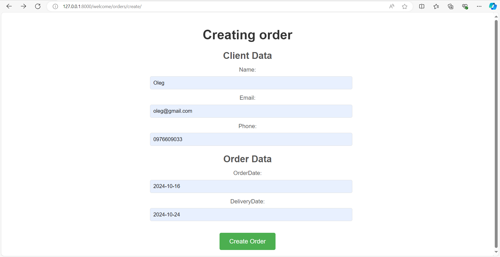
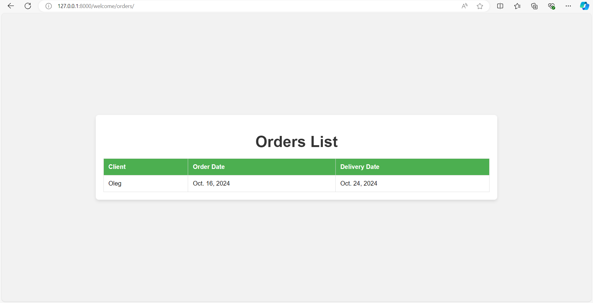

# Мій проект
Цей проект є веб-додатком для управління клієнтами та замовленнями. У ньому реалізовані функціональності для:
- Створення, редагування та видалення даних клієнтів.
- Створення, перегляду списку та відображення деталей замовлень.

---

## Основні функціональності

### Список клієнтів

### Редагування клієнта

### Видалення клієнта

### Створення замовлення

### Список замовлень

## Технології:
- **Backend**: Django, Python
- **Database**: MySQL
- **Frontend**: HTML (для шаблонів)

---

## REST API Функціонал

Через REST API можна реалізувати:
- Отримання списку клієнтів та їхніх даних.
- Додавання, оновлення та видалення клієнтів.
- Отримання списку замовлень.
- Додавання нових замовлень.
